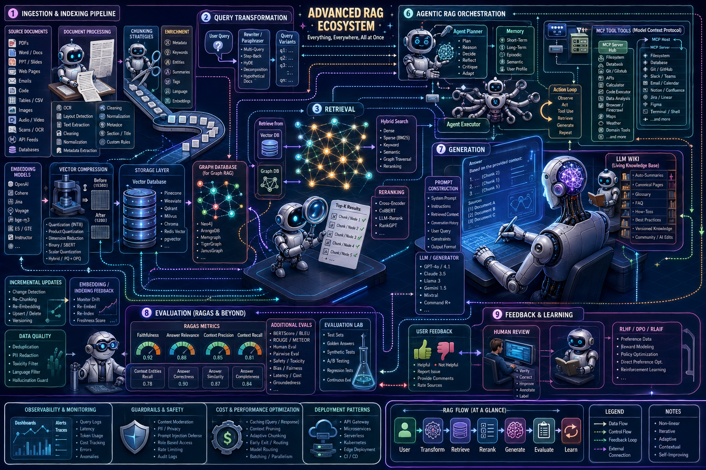

<p align="center">
  
</p>

# workshop-rag-forum

A forum for monthly meetings centred around **Retrieval-Augmented Generation (RAG)**.
Each meeting explores a different topic (embedding models, vector compression,
retrieval strategies, evaluation, etc.).

## The RAG forum at a glance

<p align="center">
  
</p>

A RAG system is a short pipeline, but almost every stage hides a knob worth turning.
Each meeting we pick one, dig in together, and compare problems, stacks, and ideas.


## Repository layout

```
03_workshop/              # one folder per meeting: YYMMDD-topic/
  260615-turbovec/        # first meeting (see its README)
data/                     # downloaded corpora & generated vectors (gitignored)
src/workshop_rag_forum/   # shared package code (from the template)
notebooks/ docs/ reports/ references/ tests/
.env_example              # copy to .env and fill in your endpoint + key
```

## Meetings

| Date     | Topic     | Folder                          | Summary                                              |
|----------|-----------|---------------------------------|------------------------------------------------------|
| 26-06-15 | turbovec  | `03_workshop/260615-turbovec/`  | Illustrating turbovec vector compression vs. a float32 embedding baseline |

## Setup

See [installation.md](installation.md) for installing uv and Python, and
[development.md](development.md) for development workflows. Copy `.env_example` to
`.env` and fill in your embedding endpoint and API key before running a meeting's scripts.

## References

- [AI Service Centre Berlin Brandenburg (KI-Servicezentrum)](https://hpi.de/ki-servicezentrum/)

## License

This project is licensed under the [MIT License](LICENSE).

---

## Acknowledgements


The [AI Service Centre Berlin Brandenburg](http://hpi.de/kisz) is funded by the [Federal Ministry of Research, Technology and Space](https://www.bmbf.de/) under the funding code 01IS22092.
