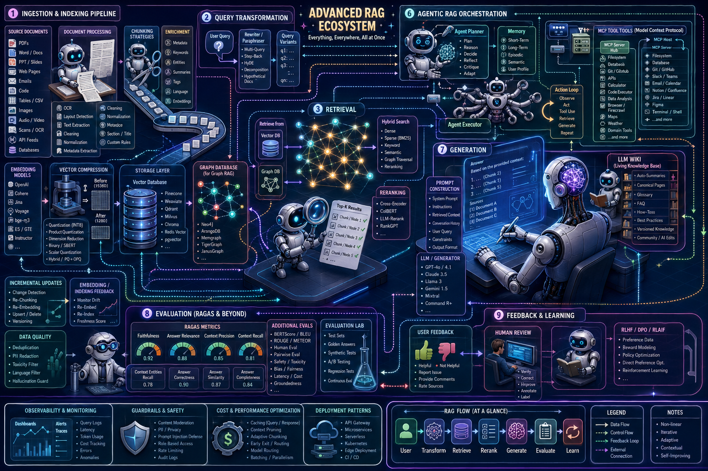

<p align="center">
  
</p>

# workshop-rag-forum

A forum for monthly meetings centred around **Retrieval-Augmented Generation (RAG)**.
Each meeting explores a different topic (embedding models, vector compression,
retrieval strategies, evaluation, etc.).

## The RAG forum at a glance

<p align="center">
  
</p>

A RAG system is a short pipeline, but almost every stage hides a knob worth turning.
Each meeting we pick one, dig in together, and compare problems, stacks, and ideas.


## Repository layout

```
src/workshop_rag_forum/   # the RAG pipeline and the bias study
  chunking, embedding, store, retrieval, generation, pipeline, cli
  biographies.py          # Wikidata-labelled dewiki corpus (P21 gender, P106 occupation)
  bias/                   # ratio.py = A = p_k/p0, study.py = the runner
03_workshop/              # one folder per meeting: YYMMDD-topic/
  260615-turbovec/        # vector compression (see its README)
  260901-rag-bias/        # measuring retrieval bias (see its README)
data/                     # corpora, indexes & results (gitignored)
notebooks/ docs/ reports/ references/ tests/
.env_example              # copy to .env and fill in your endpoint + key
```

## The RAG pipeline

`src/workshop_rag_forum/` is a small, complete RAG system rather than a demo
script. Every stage sits behind a `Protocol`, which is what lets the meetings
compare stages against each other:

| Stage | Implementations |
|-------|-----------------|
| Embedding | `OpenAIEmbedder` (any OpenAI-compatible endpoint, incl. a LiteLLM proxy), `HashEmbedder` (deterministic, offline) |
| Store | `VectorStore` — text, labels and vectors persisted **together**, exact cosine search |
| Retrieval | `DenseRetriever`, `MMRRetriever` (relevance diversification), `TurboVecRetriever` (quantised, reusing the 260615 index) |
| Generation | `OpenAIGenerator` (citation-grounded prompting), `EchoGenerator` (offline stub) |

## Measuring retrieval bias

The 260901 meeting measures **A = p_k / p₀** — a group's share of the top-k
divided by its base rate in the relevant set — on German Wikipedia biographies
labelled from Wikidata. A ratio rather than a share gap, so it is scale-free in
the base rate.

```bash
cp .env_example .env      # OPENAI_API_BASE / _API_KEY / _EMBEDDING_MODEL

uv run workshop-rag build-corpus --variant R    # realistic gender split
uv run workshop-rag build-corpus --variant K    # downsampled to 50/50
uv run workshop-rag study --variant R --ks 10,100
uv run workshop-rag show --variant R
```

Add `--offline` to exercise the pipeline with hash embeddings and no endpoint —
useful for checking the plumbing, never for a reported number.

## Meetings

| Date     | Topic     | Folder                          | Summary                                              |
|----------|-----------|---------------------------------|------------------------------------------------------|
| 26-06-15 | turbovec  | `03_workshop/260615-turbovec/`  | Illustrating turbovec vector compression vs. a float32 embedding baseline |
| 26-09-01 | rag-bias  | `03_workshop/260901-rag-bias/`  | Bias im RAG: measuring A = p_k/p₀ across occupations, with a realistic and a 50/50 corpus |

## Setup

See [installation.md](installation.md) for installing uv and Python, and
[development.md](development.md) for development workflows. Copy `.env_example` to
`.env` and fill in your endpoint, key and model names before running a meeting's
scripts.

## References

- [AI Service Centre Berlin Brandenburg (KI-Servicezentrum)](https://hpi.de/ki-servicezentrum/)

## License

This project is licensed under the [MIT License](LICENSE).

---

## Acknowledgements


The [AI Service Centre Berlin Brandenburg](http://hpi.de/kisz) is funded by the [Federal Ministry of Research, Technology and Space](https://www.bmbf.de/) under the funding code 01IS22092.
